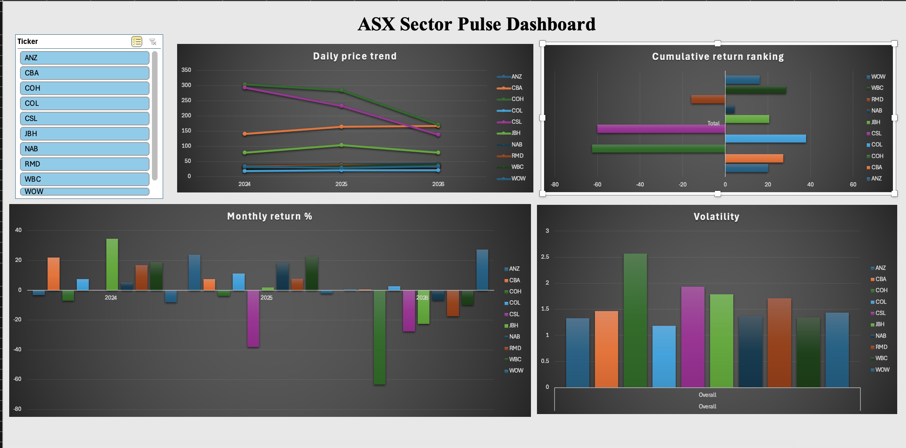

# Asx-sector-pulse

SQL + Excel analysis of 10 ASX companies across Banking, Retail, and Healthcare sectors

## About this project

I wanted to understand how different sectors of the ASX actually perform against each other, not just look at individual stock charts. So I pulled 2 years of daily price data for 10 ASX-listed companies, ran the analysis in SQL, and built an interactive Excel dashboard to explore the results.

**Companies covered:**
- **Banking:** CBA, ANZ, NAB, WBC
- **Retail:** WOW, COL, JBH
- **Healthcare:** CSL, RMD, COH

**Tools used:** SQLite (via DBeaver), Microsoft Excel (PivotTables, PivotCharts, Slicers)

## The questions I was trying to answer

1. How has each stock's price moved over the past 2 years?
2. Which months were strong or weak for each stock?
3. Which stocks are stable, and which are risky?
4. If I'd invested $100 in each stock 2 years ago, which made the most money?
5. Which stock gave the best return for the risk taken?
6. What's the basic price range and trading summary for each stock?

## Files in this repo

- `sql/analysis_queries.sql` - all 6 queries, each with the business question it answers
- `dashboard/dashboard_screenshot.png` - the final Excel dashboard

## Dashboard

The dashboard uses a linked slicer, clicking any ticker filters the Daily Price Trend, Monthly Return %, and Volatility charts at the same time.

## Key findings

- **WBC** delivered the strongest cumulative return over the 2-year period (+28.5%) while staying relatively stable
- **COH** was the most volatile stock in the dataset and posted the steepest decline (-62.5%). This wasn't a data artifact, Cochlear's share price genuinely fell from a 52-week high near $320 to a low near $89 during this period, reflecting real headwinds the company faced rather than a stock split or pricing error

## What I learned

Working on this taught me more about the practical side of data work than I expected:

- Real-world data is messy. I had to clean inconsistent date formats before I could run any real analysis
- Small PivotTable settings like Sum vs. Average can completely change your results if you're not paying attention
- Excel slicers only connect PivotTables that share the same data source, which changed how I had to structure my SQL output

## Let's connect

Open to feedback on this project, or happy to walk through the build with anyone working on something similar.
